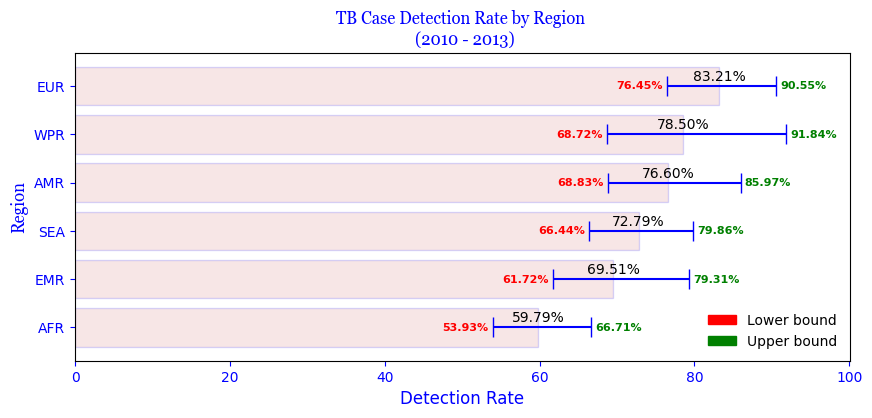

# `TB-BURDEN-IN-THE-WORLD`
TB Burden analysis in the world

# Tuberculosis Burden (1990‑2013)

## Overview

Tuberculosis (TB) remained one of the leading infectious causes of morbidity and mortality globally throughout 1990‑2013. Over that period, there have been substantial improvements in surveillance, diagnostics, treatment, and prevention, particularly in the 2000s, which have begun to show impact in incidence, prevalence, and deaths. However, progress is uneven, with high burden and resource‑constrained settings still carrying the bulk of disease.

Key metrics to track are:

* **Incidence**: number of new TB cases per year (all forms, including among HIV‑positive and HIV‑negative people)
* **Prevalence**: number of existing TB cases at a given time
* **Mortality**: number of deaths from TB
* **Changes over time**: annual rate of change, trend breaks, percentage declines/increases

The data sources include the Global Burden of Disease Study 2013, WHO Global TB Reports, and other WHO estimates. ([PMC][1])

---

## Global Trends 1990‑2013

| Metric                                                 | 1990 Estimate                              | Trend (1990‑2000)                                                                              | Trend (2000‑2013)                                                                                                                                 | 2013 Estimate                                                                                              |
| ------------------------------------------------------ | ------------------------------------------ | ---------------------------------------------------------------------------------------------- | ------------------------------------------------------------------------------------------------------------------------------------------------- | ---------------------------------------------------------------------------------------------------------- |
| **Incidence** (all TB, including HIV‑positive; global) | —                                          | increasing or stable in many places; rise through the 1990s                                    | after \~2000, incidence growth slows, then begins to decline modestly in many parts of world; \~1‑2 % per year decline in some metrics ([PMC][1]) | \~7.5 million new TB cases in 2013 (all forms, all persons) ([PMC][1])                                     |
| **Incidence (HIV‑negative persons)**                   | \~5.0 million new cases in 1990 ([PMC][1]) | increasing until \~2000                                                                        | decreasing moderately after 2000 (annualised rate of change becoming negative) ([PMC][1])                                                         | \~7.1 million in 2013 for HIV‑negative persons (new cases) ([PMC][1])                                      |
| **Prevalence**                                         | —                                          | small increase in some regions in 1990‑2000; then decline in many areas post‑2000 ([PMC][1])   | decline from 2000 onward; the duration of TB cases reduced somewhat, as treatment improves. ([PMC][1])                                            | \~11.9 million prevalent cases (all persons) in 2013; \~11.2 million among HIV‑negative persons ([PMC][1]) |
| **Mortality (deaths per year)** (all TB)               | —                                          | high, especially in 1990s, particularly with HIV co‑infection effects rising in many countries | significant declines; mortality falling \~1‑2 % per year in many places; accelerated after 2000 ([PMC][1])                                        | \~1.4 million deaths in 2013 (all persons); \~1.3 million deaths among HIV‑negative people ([PMC][1])      |

Additional key points:

* The **case fatality ratio** (deaths / incidence) has been falling over time, indicating that more people who get TB are being diagnosed, treated effectively, and surviving. ([PMC][1])
* The disease disproportionately affects **men/boys** more than women/girls among HIV‑negative individuals — e.g., in 2013 \~64% of cases and 65% of deaths among HIV‑negative TB were among men/boys. ([PMC][1])
* HIV co‑infection remains a major complicating factor: a substantial portion of TB incidence and deaths occur in HIV‑positive persons; though many countries have scaled up HIV treatment, prevention, and TB/HIV integrated care. ([World Health Organization][2])
* Multi‑drug resistant TB (MDR‑TB) is an increasing concern: though it remains a smaller subset of overall TB, diagnostics and detection have improved, but treatment coverage and cure rates lag. ([World Health Organization][2])

---

## Focus: 2010‑2013

From 2010 through 2013, this period marks a phase where the gains in global TB control became more visible in the data. Key observations in this period include:

1. **Estimated cases and deaths in 2013**

   * Approximately **9.0 million persons** developed TB in 2013 (all forms, all persons) according to WHO. ([World Health Organization][2])
   * TB caused about **1.5 million deaths** in 2013, including about 360,000 among HIV‑positive people. ([World Health Organization][2])
   * For HIV‑negative people in 2013: \~7.1 million new TB cases; \~1.3 million deaths. ([PMC][1])

2. **Yearly rate of change / trends**

   * Incidence (new cases) globally is estimated to decline by \~1.5% per year after 2000. ([World Health Organization][2])
   * Mortality declined significantly; since 1990, TB mortality has dropped by around 45% by 2013. ([World Health Organization][2])
   * Prevalence also declining after 2000. ([PMC][1])

3. **Diagnostic improvements, reporting, and data quality**

   * Improved surveillance and reporting over this period led to adjustments in estimates — for example, in 2013, more cases were identified or estimated than had been in prior estimates. Some of the increase in case numbers is attributed to better detection rather than true increase in transmission. ([World Health Organization][2])
   * More countries implemented prevalence surveys, better lab diagnostics, and efforts to address under‑reporting. ([arXiv][3])

4. **TB/HIV comorbidity**

   * In 2013, \~1.1 million of TB incident cases were HIV‑positive (\~13% of all TB cases). ([World Health Organization][2])
   * Deaths among HIV‑positive TB cases fell over time, e.g. from \~540,000 in 2004 to \~360,000 in 2013. ([World Health Organization][2])

5. **MDR‑TB & Drug Resistance**

   * Globally in 2013, about 3.5% of all persons who developed TB had multi‑drug resistant TB (MDR‑TB), which is much harder and more costly to treat. ([World Health Organization][2])
   * Of the estimated MDR‑TB cases, only some fraction are detected and treated; treatment success rates are relatively low (globally only \~48% of diagnosed MDR‑TB patients were cured in 2013). ([WHO Dev CMS][4])

6. **Lives saved and progress toward goals**

   * Since 2000, tens of millions of lives have been saved through more effective diagnosis and treatment of TB. WHO estimates \~37 million lives saved between 2000‑2013. ([World Health Organization][2])
   * Part of the achievement of MDG (Millennium Development Goals) targets: one MDG called for halting and reversing TB incidence by 2015. By 2013, incidence was indeed declining, though the pace needed to be accelerated. ([World Health Organization][5])

7. **Challenges remaining**

   * Gaps in detection and under‑reporting: many TB cases still go undiagnosed or unreported. ([World Health Organization][2])
   * Treatment success rates for drug‑resistant TB are low. MDR‑TB remains a threat and resource constraints hamper scale‑up. ([WHO Dev CMS][4])
   * HIV remains a complicating factor, particularly in high HIV prevalence settings, due both to increased risk of TB and higher mortality. Integrating TB/HIV services remains critical.
   * Geographic disparities: some regions (Sub‑Saharan Africa, South Asia, Eastern Europe / Central Asia) bear much of the burden; many countries still have high rates of TB incidence and mortality.

---

## Quantitative Summary for 2010‑2013

Here are some specific numbers and estimates in the 2010‑2013 period to illustrate the scale:

* **2013**

  * Incident TB cases: \~9.0 million all persons. ([World Health Organization][2])
  * Deaths from TB: \~1.5 million (all persons). ([World Health Organization][2])
  * Incident cases among HIV‑negative persons: \~7.1 million; deaths among HIV‑negative persons: \~1.3 million. ([PMC][1])
  * Prevalent cases: \~11.9 million globally (all persons). ([PMC][1])

* **Change rates**

  * Incidence decline: \~1.5% per year globally after 2000. ([World Health Organization][2])
  * Mortality decline since 1990: \~45% reduction by 2013. ([World Health Organization][2])

* **Drug resistance**

  * MDR‑TB in 2013: \~3.5% of TB cases were MDR‑TB. ([World Health Organization][2])
  * Number of MDR‑TB cases detected: in 2013, \~136,000; number started on treatment: \~97,000. ([WHO Dev CMS][4])
  * Treatment outcome (cure) among those treated: \~48%. ([WHO Dev CMS][4])

* **TB/HIV**

  * HIV‑positive TB incident cases in 2013: \~1.1 million (≈13% of all TB cases). ([World Health Organization][2])
  * TB deaths among HIV‑positive people in 2013: \~360,000. ([World Health Organization][2])

---

## Interpretation & Implications

* The period 2010‑2013 marks solid progress: incidence, prevalence, and mortality all either stabilising or declining globally (especially post‑2000). However, declines are modest and not yet sufficient to meet many of the global targets (e.g. ambitious reductions in incidence & mortality).

* The falling case fatality implies that diagnosis and treatment are improving (scope, reach, quality). This is good news.

* However, challenges with HIV co‑infection, drug resistance, and under‑detection remain key obstacles.

* The global burden is large in absolute numbers: millions of new cases and deaths annually. Even though per capita rates may be decreasing in many places, population growth in many high‑burden areas can offset gains, so absolute numbers may stay high for some time.

* Regions with weaker health systems, resource limitations, and high HIV prevalence are particularly vulnerable; targeted investments and catch‑up will be necessary.

* Continued improvements in surveillance, treatment (especially for MDR‑TB), integration of HIV/TB services, and preventive interventions (vaccination, latent TB infection management, social determinants like poverty/housing/nutrition) are essential.

---

## Gaps / Uncertainties

* **Data quality and reporting**: Even by 2013, many countries had incomplete reporting, under‑diagnosis, and under‑notification of TB cases. Differences in methods of estimation (surveys, models, notification data) contribute to uncertainty. ([arXiv][3])

* **HIV status disaggregation**: While estimates separate HIV‑positive vs HIV‑negative in many studies, not all settings have high reliability of co‑infection data.

* **Drug resistance data**: Limited by lab capacity and by under‑reporting of MDR‑TB; treatment data (especially cure rates) for MDR‑TB are less robust.

* **Latency and TB infection pool**: Estimating latent TB infections (people infected but not active disease) is difficult but important for long‑term control.

* **Sub‑national variation**: Global/regional averages conceal large differences between countries and even within countries. High performing vs low performing contexts differ greatly.

---

## Key Takeaways for 2010‑2013

* TB remains a massive public health burden globally, but in 2010‑2013 signs of sustained progress are visible.

* Mortality has been cut nearly in half since 1990, and incidence is declining modestly.

* HIV co‑infection and drug resistance remain key challenges.

* Gaps in detection and treatment persist, especially in resource‑poor settings.

* For policy, further scale‑up of diagnostic capacity, improved treatment access (especially for MDR‑TB), stronger TB/HIV integration, and socio‑economic determinants should be priorities.

---

[1]: https://pmc.ncbi.nlm.nih.gov/articles/PMC4202387/?utm_source=chatgpt.com "Global, regional, and national incidence and mortality for HIV, tuberculosis, and malaria during 1990–2013: a systematic analysis for the Global Burden of Disease Study 2013 - PMC"
[2]: https://www.who.int/news/item/23-10-2014-improved-data-reveals-higher-global-burden-of-tuberculosis?utm_source=chatgpt.com "Improved data reveals higher global burden of tuberculosis"
[3]: https://arxiv.org/abs/1603.00278?utm_source=chatgpt.com "Methods used by WHO to estimate the Global burden of TB disease"
[4]: https://dev-cms.who.int/news/item/23-10-2014-improved-data-reveals-higher-global-burden-of-tuberculosis?utm_source=chatgpt.com "Improved data reveals higher global burden of tuberculosis"
[5]: https://www.who.int/news-room/detail/28-10-2015-tuberculosis-mortality-nearly-halved-since-1990?utm_source=chatgpt.com "Tuberculosis mortality nearly halved since 1990"

